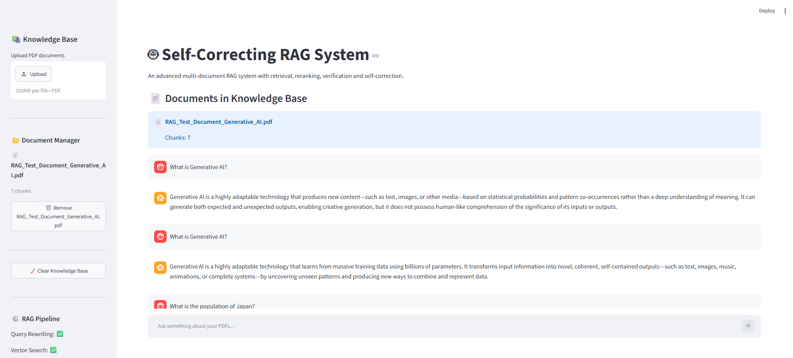
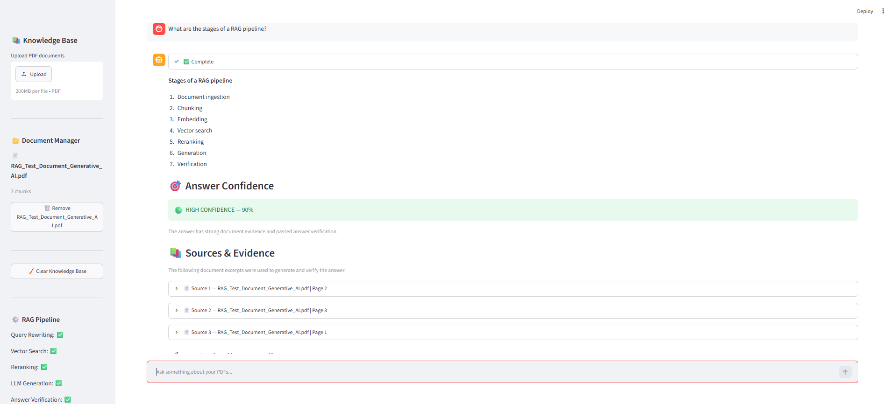
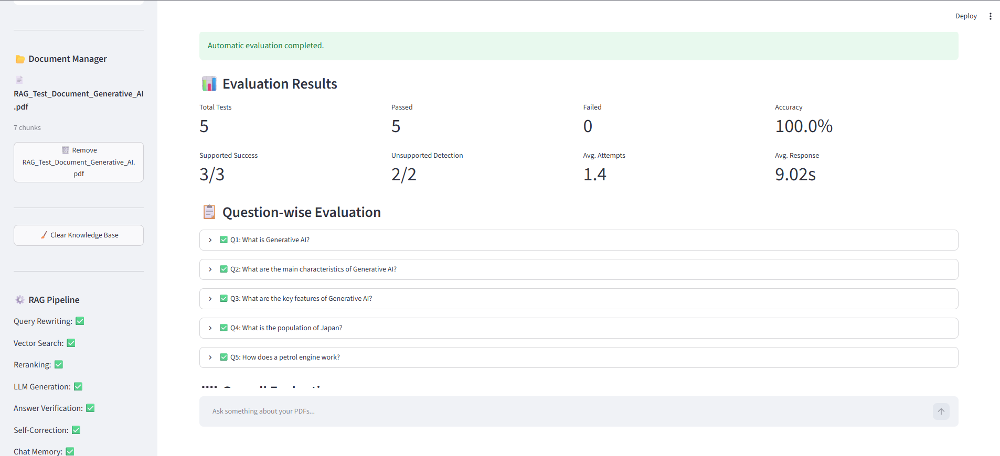
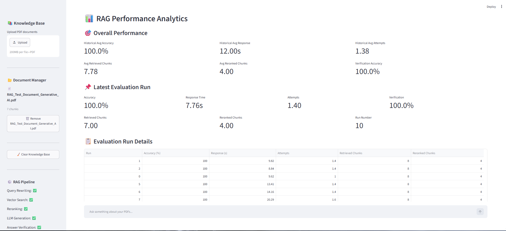

# 🤖 Self-Correcting RAG System

An advanced **Retrieval-Augmented Generation (RAG)** application that answers questions from uploaded PDF documents using semantic retrieval, reranking, answer verification, confidence scoring, and self-correction.

The system is designed to reduce **LLM hallucinations** by checking whether generated answers are actually supported by the uploaded knowledge base.

---

## 🚀 Project Overview

Traditional LLM applications can generate convincing answers even when the required information is not available in their knowledge source.

This project addresses that problem by implementing a **Self-Correcting RAG Pipeline**.

The system:

1. Accepts PDF documents from the user
2. Extracts and processes document content
3. Splits documents into searchable chunks
4. Generates vector embeddings
5. Performs semantic vector search
6. Reranks retrieved chunks
7. Generates an answer using an LLM
8. Verifies the generated answer against retrieved evidence
9. Calculates answer confidence
10. Performs self-correction for unsupported responses
11. Maintains evaluation and performance history

---

## 🧠 RAG Architecture

```text
                    ┌──────────────────────┐
                    │      PDF Upload      │
                    └──────────┬───────────┘
                               │
                               ▼
                    ┌──────────────────────┐
                    │  Document Ingestion  │
                    └──────────┬───────────┘
                               │
                               ▼
                    ┌──────────────────────┐
                    │      Chunking        │
                    └──────────┬───────────┘
                               │
                               ▼
                    ┌──────────────────────┐
                    │     Embeddings       │
                    └──────────┬───────────┘
                               │
                               ▼
                    ┌──────────────────────┐
                    │    Vector Search     │
                    └──────────┬───────────┘
                               │
                               ▼
                    ┌──────────────────────┐
                    │      Reranking       │
                    └──────────┬───────────┘
                               │
                               ▼
                    ┌──────────────────────┐
                    │    LLM Generation    │
                    └──────────┬───────────┘
                               │
                               ▼
                    ┌──────────────────────┐
                    │  Answer Verification │
                    └──────────┬───────────┘
                               │
                    ┌──────────┴──────────┐
                    │                     │
                Supported             Unsupported
                    │                     │
                    ▼                     ▼
              Final Answer       Self-Correction /
                                  Safe Response

                                ---

## 📸 Screenshots

### 🏠 Main Dashboard



### 🤖 RAG Answer Generation



### 📊 RAG Evaluation



### 📈 Performance Analytics



---

## 🚀 Future Improvements

- Support for more document formats
- Advanced hybrid retrieval
- Improved reranking models
- Better evaluation metrics
- Cloud deployment
- Multi-user authentication